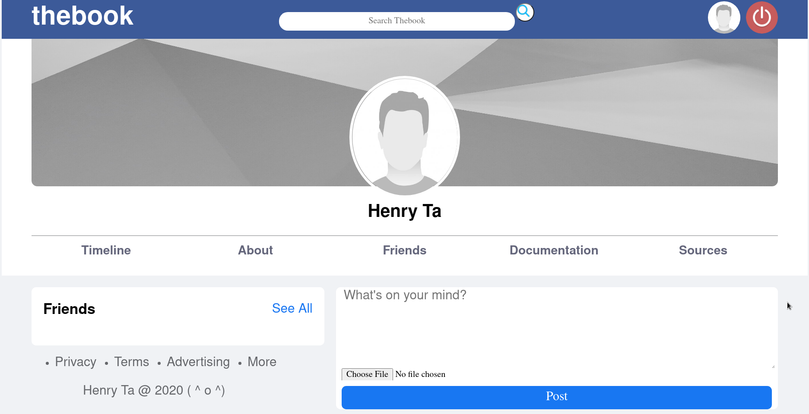

# [THE BOOK](https://the-book-henry.herokuapp.com/)

## Table of contents

- [General info](#general-info)
- [Usage](#usage)
- [Screenshots](#screenshots)
- [Features](#features)
- [Status](#status)
- [License](#license)
- [Contact](#contact)

## General info

The Book is a clone site base on [facebook](https://facebook.com). Written in HTML, JS, CSS and PHP

## Usage

- User needs to sign up an account before using

## Screenshots

Home

User Profile

Timeline

## Features

- Sign Up / Log In / Log Out
- Posting Status / Photos
- Search other users
- Make friends

## Status

## License

## Contact

Created by [Henry Ta](https://github.com/Henry-Ta)
